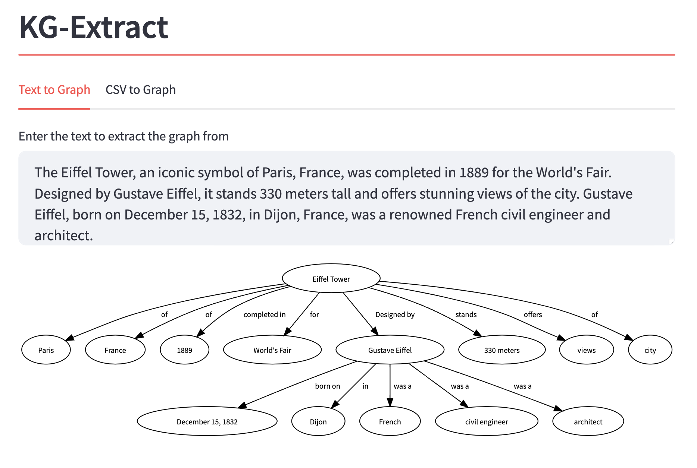

# KG Extract
A python tool for extracting knowledge graphs from text using OpenAI ChatGPT for graph extraction and Neo4j for storing the graph database.

## Getting Started
1. Install and run Neo4j
2. (Optional) Set Up a Virtual Environment:
3. Install dependencies:
  
```
pip install -r requirements.txt
```

4. Create a .env file and populate it with the required environment variables.
  
```
OPENAI_API_KEY
NEO4J_HOST
NEO4J_PORT
NEO4J_USER
NEO4J_PASSWORD
```


## Usage 

#Option 1: Graph Extraction and Visualization via Streamlit Interface



To use the Streamlit interface for graph extraction and visualization, modify the main function in Main.py to call the display_interface() function. Then, run the following command:
```
streamlit run main.py
```

#Option 2: Graph Extraction and Neo4j Storage from File
For graph extraction and storage in Neo4j from a file, modify the main function in Main.py to use the desired function, such as run_csv_to_graph_and_neo4j_storage(). After making the changes, execute the following command:

```
python3 main.py
```

Feel free to modify the code instructions as needed.